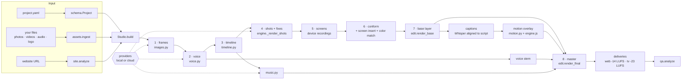
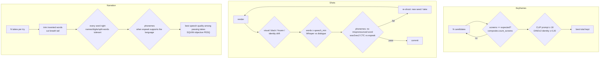
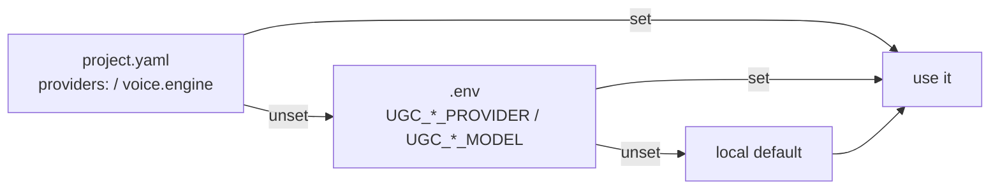
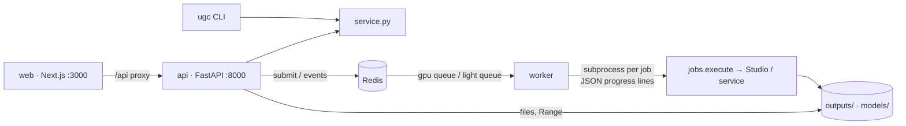

# UGC Studio — Architecture

How the system is built, why, and where to change what. For *using* it, see [GUIDE.md](GUIDE.md).

---

## 1. In one paragraph

A video is a **project folder** holding a declarative `project.yaml`: scenes, voice, music, brand and so on.
`ugc render` runs **`Studio.build()`**, a fixed pipeline of stages:

- keyframes → narration → timeline → music → AI shots → screen recordings → conform → edit → graphics → mix → deliveries.

Three rules shape every stage:

- **Content-addressed caching.** Each stage caches every asset under the hash of everything it was made from. Changing one thing regenerates only what depends on it.
- **Automatic quality gates.** Every generated asset is checked, and regenerated if it fails. The gates check pronunciation, identity, prompt match, screen detection and more.
- **Pluggable generation.** Generation goes through **providers**: local open-source models by default (FLUX.2, LTX-2.5, Qwen3-TTS / Chatterbox / Habibi, ACE-Step), or cloud APIs (Veo, Kling, Seedance, OpenAI, Gemini, ElevenLabs, Hugging Face). The quality gates, the edit and the caching are identical whichever provider runs.

## 2. Design principles

| Principle | What it means in the code |
|---|---|
| **Declarative** | `project.yaml` (validated by `schema.py`, pydantic, strict) is the only source of truth. Fixes, takes and provider choices are all recorded there, so every build is reproducible. |
| **Incremental** | `state.py` stores `{asset key → hash(inputs), output files, metadata}`. `plan()` uses the *same* hashes as `build()` without loading any model. |
| **Deterministic** | Seeds come from the project seed and the scene index. Motion graphics are rendered frame by frame from a seekable timeline, so the same inputs give the same pixels. |
| **Gate everything** | No generated asset reaches the edit unchecked (see §8). |
| **Local-first, 12 GB GPU** | Heavy models load lazily, one at a time. The judges (Whisper, CLIP, DINOv2, the phoneme model, SQUIM) run on the CPU while the GPU holds the video model. |
| **Surgical** | A bad frame or line is fixed by recording a fix or a new take. Only that asset, and the edit, are rebuilt. |

## 3. Repository map

```
src/ugc_studio/
  cli.py          `ugc` command line (typer + rich): every user-facing command
  service.py      operations shared by the CLI and the API (edit project, voice, timeline, fixes, export, QA...)
  api.py          HTTP API (FastAPI): everything the CLI does + uploads, files, jobs, SSE progress
  jobs.py         background jobs: Redis or in-memory store, gpu/light queues, subprocess runner, cancel
  engine.py       Studio: plan() and build(), stage orchestration, shot quality gate (_best_take)
  schema.py       Project model (pydantic): scenes, voice, music, brand, providers, fixes...
  state.py        content-addressed cache (.ugc/state.json): fresh(), commit(), ref(), file_hash()
  config.py       paths, env-overridable model ids (UGC_*), .env loader, resolutions, LTX frame rules
  providers/      generation backends (§9): base.py interfaces + HTTP helpers, __init__.py registry,
                  local.py, openai.py, gemini.py, elevenlabs.py, kling.py, seedance.py, huggingface.py
  images.py       frames stage: identity refs, start/end/seam keyframes, best-of-N + gates
  keyframes.py    local FLUX.2 klein generator (multi-reference, OOM fallback)
  render.py       local LTX-2.5: ShotRenderer (a VideoBackend) and RetakeRenderer (time-window retakes)
  voice.py        narration: engine choice, generation, trim/cut, word + phoneme + quality gates, best take,
                  your own voice-over file, stale-line detection
  workers/        scripts run inside separate Python environments (qwen/chatterbox/habibi TTS, ACE music)
  music.py        music bed: provider generation + candidate scoring (groove, energy, clipping)
  timeline.py     edit timeline: slots, transitions, J-cut voice placement, exact-length fitting, locate()
  edit.py         ffmpeg: live-action base layer, voice stem (+ polish EQ), final mix, deliveries
  motion.py       motion-graphics composition → headless Chromium frame capture → RGBA overlay
  motion/         the HTML/CSS/GSAP engine (engine.js, style.css) and its npm assets
  composite.py    "real app on an AI phone": chroma screen tracking, perspective warp, despill
  media.py        ffmpeg/PyAV helpers: probe, BT.709-exact frame I/O, conform, LUT color match
  asr.py          Whisper transcription, text normalization, similarity (names, digits, split words)
  phonetics.py    phoneme-level pronunciation check (wav2vec2 CTC + espeak-ng)
  judge.py        CLIP prompt score, DINOv2 identity score, per-clip visual checks
  quality.py      speech quality of voice takes (SQUIM objective PESQ estimate, CC-BY-4.0)
  fix.py          surgical fixes: interpolate / freeze / retake (+ plan_fix time mapping)
  director.py     LLM (Qwen3.5-9B, 4-bit) writes the creative beats; Python assembles a valid Project
  styles.py       mode/style presets, keyframe and video prompt builders (+ unbranded devices rule)
  site.py         website analysis (colors, fonts, logo, headlines) and screenshots (Playwright)
  personas.py     reusable characters (face refs + voice) in personas/<name>/
  assets.py       ingestion of your files: any image/video/audio → normalized, validated
  qa.py           final QA report: loudness, black/frozen/flicker, speech vs script, contact sheet
docs/             GUIDE.md (usage), ARCHITECTURE.md (this file), LICENSES.md, openapi.json, media/
web/              Next.js web app (guided creation, storyboard, render, fix, voice, timeline editor)
Dockerfile, docker-compose.yml, docker/   api + worker image; compose: redis, api, worker (GPU), web
tests/            pytest suite with stubbed models + mocked HTTP APIs (no GPU, no keys needed)
personas/         saved personas (e.g. lina)
vendor/LTX-2      pinned git submodule (LTX-2 pipelines); other vendor/* are created by `ugc setup`
```

## 4. The big picture



## 5. The project model (`schema.py`)

- **Project:**
  - identity: `title`, `mode` (ugc · influencer · faceless · promo), `style`, `aspect` (9:16 · 16:9 · 1:1 · 4:5), `quality` (draft … tv), `fps`, `language`, `seed`
  - look and fit: `look`, `target_seconds`
  - sections: `brand`, `characters`, `products`, `voice`, `music`, `captions`, `providers`, `pronounce`
  - quality knobs: `image_candidates`, `speech_min`, `speech_retries`, and more
- **Scene kinds:**

  | kind | made by | typical use |
  |---|---|---|
  | `shot` | video provider (LTX-2.5 by default) | live action, optional on-camera `dialogue` (lip-sync) or `voiceover` |
  | `clip` | your own footage (`video`, `clip_in`) | real footage mixed into the edit |
  | `image` | a still (yours or generated) with Ken Burns motion | |
  | `title`, `screen`, `devices`, `features`, `endcard` | motion-graphics engine | logo reveal, app on a phone/laptop, 3-device fan, feature cards, CTA + QR |

- **Per-scene controls:**
  - continuity (`cut` · `match` · `continue`), `start_prompt` / `end_prompt` / `start_image` / `end_image`
  - `transition`, `caption`, `screen_insert` (put a real screen on an AI phone)
  - `fixes` (surgical repairs), `take` (a new video take) and `voice_take` (a new narration take)
- **`pronounce`** maps a written form to a spoken form ("DZ-MeNU" → "دي زاد مينيو"). Scripts and captions keep the written form; only the voice gets the spoken one. The word check tolerates free spellings of these names.
- **Personas** (`personas/<name>/`) inject the same face references and voice into any project (`character.persona`).

## 6. Build pipeline, stage by stage (`engine.py`)

| # | Stage | What happens | Cache key contains |
|---|---|---|---|
| 1 | **frames** | Identity references (generated if you gave no photo). One start keyframe per `cut` shot. Seam frames shared across `match` cuts. `end_prompt` frames. Best-of-N with gates. | prompt, reference *file hashes*, seed, size, image provider |
| 2 | **voice** | Every narration line: generate, trim invented words, cut breath tails, gate on words, phonemes and quality, keep the best take. Or cut *your* recording per scene (`voice.file`). | engine, reference voice, text, take, worker code hash |
| 3 | **timeline** | Slot starts and lengths from scene `seconds`, voice lengths (J-cut lead) and transition overlaps. Fitted exactly to `target_seconds` (the endcard absorbs the difference). | recomputed every build (cheap) |
|   | **music** | N candidates from the music provider, scored for groove regularity, steady energy and no clipping; the best is kept. | caption, length, bpm, seed, provider |
| 4 | **shots** | The video provider renders every stale shot. The shot gate (§8) may re-shoot it. Then `fixes` are applied. | prompt, size, frame count, seed, start/end frame hashes, previous clip (for `continue`), provider |
| 5 | **screens** | Scroll recordings of real URLs (Playwright) for `screen` / `devices` scenes and `screen_insert`. | URL, device, scroll plan |
| 6 | **conform** | Every clip goes to canvas size, fps and exact length, with one color LUT per continuity chain. Green phone screens are replaced by the real app (`composite.insert_screen`, with a residual-green gate). | clip hash, slot, LUT, insert |
| 7 | **base / stem / captions / overlay** | **Base:** consecutive shots are joined with xfade/acrossfade over a black canvas. **Voice stem:** the lines placed on the timeline, plus a light EQ and de-esser. **Captions:** Whisper word timing aligned to the *script's* words. **Overlay:** the motion-graphics RGBA layer rendered in Chromium. | clip hashes, timeline, code hash, composition JSON, engine hash |
| 8 | **master + deliveries** | Composite and mix (voice ducking over music), then `web` (-14 LUFS) / `tv` (-23 LUFS) encodes. `ugc export` also makes vertical / square crops and covers. | master hash, delivery kind |

GPU residency: FLUX (frames) is closed before the TTS worker runs, then ACE-Step, then LTX (shots); Whisper runs on the CPU during shot gating. Only one large model is in VRAM at any time.

## 7. Caching and state (`state.py`)

- `ref(path)` → `{"path", "hash"}`, where the hash is of the **file content**. A regenerated upstream image therefore invalidates everything built from it, even under the same file name.
- `fresh(key, inputs)` is true only if the stored hash of `inputs` matches *and* the output files still exist.
- The edit stages also hash the code of the modules that produced them (`_code_hash`, `_engine_hash`), so a bug fix in the edit logic re-renders the edit, never the AI shots.
- **Provider neutrality:** a provider enters a cache key only when it isn't `local`. Switching providers regenerates; existing local caches stay valid.
- `Studio.plan()` walks the same keys and reports exactly what `build()` would regenerate, with time estimates learned from past renders (`record_timing`).

## 8. Quality gates (why the output is trustworthy)



- **Arabic** speech gets a second, more literal transcript from Qwen3-ASR next to Whisper. A line passes only when both agree. The second opinion tolerates dialect spellings (a word counts when 80% of its letters match), while Whisper stays strict. In testing, this caught a take where Whisper heard « وارتاح » but the voice said « واجتهد ».
- The **pronunciation** check exists because Whisper is a language model: it "hears" *bancaire* even when the speaker said *banchaire*. The phoneme model has no language model, so it doesn't correct what it hears.
- **Tolerances are deliberately narrow:**
  - voicing assimilation and dropped final consonants are ignored;
  - brand names (from `pronounce`) are compared by letters, ignoring spaces;
  - digits are spelled out (num2words);
  - a word split differently (« ويخرجلك » vs « ويخرج لك ») counts as the same word.

  Real mistakes (a wrong consonant, a missing word) still fail.
- A **transformation**'s end frame is judged for identity against people and products only, never against its own start frame, which it is meant to differ from.
- **Final QA** (`qa.py`) runs on the delivery: loudness and peaks, black / frozen / flicker frames (ignoring designed transitions and 3D bursts), speech vs script, and a contact sheet.

## 9. Providers (`providers/`)

### Interfaces (`providers/base.py`)

| Interface | Method | Contract |
|---|---|---|
| `ImageBackend` | `generate(prompt, w, h, seed, references, out_path) → PIL.Image` | exact size; `supports_references` |
| `VideoBackend` | `render(prompt, out, w, h, num_frames, seed, images, fps) → Path` | exactly `num_frames` at `fps`, `w×h`, **with an audio track**; `images` are first/last-frame conditions; flags `makes_audio`, `supports_end_frame`, `supports_retake` |
| `VoiceBackend` | `synthesize(lines, out_dir, language, voice)` | writes `<id>.wav` per line |
| `MusicBackend` | `generate(caption, seconds, bpm, seed, candidates, out_dir)` | writes `cand<k>.wav` |

Cloud video clips are normalized by `conform_clip()`: cover-crop to `w×h`, resampled to the project fps, padded or trimmed to the exact frame count, and given a silent track if the model made no sound. The engine can't tell a cloud clip from a local one.

### Resolution order (`providers/__init__.py`)



`providers.create(project, kind)` checks the API key up front, with the variable's name in the error. The backend module is imported only when used, so the cloud path never loads torch and the local path never needs a key.

### Available backends

The dates below are from the official docs, checked 2026-09-25.

| Capability | Provider | Default model | Key(s) | Notes |
|---|---|---|---|---|
| image | `local` | **Qwen-Image-Edit-2511** (GGUF Q4 + Lightning 4-step) for frames with references; **Z-Image Turbo** or FLUX.2 klein 4B without | — | smart routing by frame, one engine loaded at a time; falls back to FLUX when a model isn't downloaded |
| image | `openai` | `gpt-image-2.5-flare` | `OPENAI_API_KEY` | `/images/edits` with up to 16 references, `input_fidelity: high` |
| image | `gemini` | `gemini-3.1-flash-image` | `GEMINI_API_KEY` | Interactions API; up to 14 references |
| image | `huggingface` | `black-forest-labs/FLUX.1-schnell` | `HF_TOKEN` | router `hf-inference` or `fal-ai`; no references |
| video | `local` | LTX-2.5 22B distilled (fp8) | — | native audio and lip-sync, first/last frame, retakes |
| video | `veo` | `veo-3.1-generate-preview` | `GEMINI_API_KEY` | first/last frame, audio; 4/6/8 s clips (8 s at 1080p) |
| video | `kling` | `kling-3.0` | `KLING_API_KEY` | first/last frame, native audio, 3–15 s |
| video | `seedance` | `dreamina-seedance-2-5-260628` | `ARK_API_KEY` | BytePlus ModelArk; first/last frame, audio, 4–30 s |
| voice | `qwen` · `chatterbox` · `habibi` | Qwen3-TTS · **Chatterbox Multilingual v3** · Habibi Specialized | — | 10 languages · 23 incl. Arabic (automatic diacritics) · Arabic dialects |
| voice | `elevenlabs` | `eleven_multilingual_v2` | `ELEVENLABS_API_KEY` (+ voice id) | Arabic supported |
| voice | `openai` | `gpt-4o-mini-tts` | `OPENAI_API_KEY` | style from `voice.description` |
| voice | `gemini` | `gemini-3.8-flash-tts` | `GEMINI_API_KEY` | 30 voices; MSA and Egyptian Arabic |
| music | `local` | ACE-Step 1.5 turbo (XL with `UGC_ACE_CONFIG=acestep-v15-xl-turbo`) | — | |
| music | `elevenlabs` | `music_v2` | `ELEVENLABS_API_KEY` | `force_instrumental` |

Not offered, on purpose:
- **OpenAI Sora:** the Sora API was shut down on 2026-09-24.
- **Imagen 4:** shut down; Gemini image replaces it.

Retakes (`ugc fix --mode retake`) always use local LTX-2.5.

### Local model checkpoints

Every local model id or file is an environment variable (`config.env()`), listed in [.env.example](../.env.example). Examples: `UGC_LTX_TRANSFORMER`, `UGC_LTX_QUANTIZATION`, `UGC_FLUX_REPO`, `UGC_ASR_MODEL`, `UGC_DIRECTOR_LLM`, `UGC_TTS_CLONE_MODEL`, `UGC_CLIP_MODEL`. `ugc providers [project]` shows the resolved configuration.

### Adding a provider (checklist)

1. Create `providers/<name>.py` with a subclass of the right interface, and a docstring naming the doc URL and the date you checked it.
2. Use `base.client()`, `check()`, `poll()` and `download()` (plus `conform_clip()` for video). Never hand-roll HTTP.
3. Register it in `providers/__init__.py`: add the entry to `IMAGE` / `VIDEO` / `VOICE` / `MUSIC`, and its keys to `KEYS`.
4. Add the name to the `Literal` in `schema.Providers` (or `Voice.engine`).
5. Add it to `.env.example`.
6. Add a mocked-HTTP test in `tests/test_providers.py`: request shape, polling, decode, conform.

## 10. Voice-over modularity (`ugc voice …`)

The narration is independent of the picture, so changing it must never re-render video:

| Command | Effect |
|---|---|
| `ugc voice list P` | every line: text, word accuracy, sound quality (PESQ estimate), length, what Whisper heard, what would be redone |
| `ugc voice set P scene "text"` | new words for one line |
| `ugc voice redo P scene…` | a new take (`voice_take += 1`); the other lines stay cached |
| `ugc voice engine P elevenlabs --voice-id …` | re-voice every line with another engine or voice |
| `ugc voice file P my_vo.mp3` | use your recording; it's transcribed and cut per scene |

Each command edits `project.yaml` (keeping a `.bak`), then runs `plan()`. If any frame, shot or fix would need regenerating, it **refuses** and tells you to use `ugc render`. Otherwise it runs `build(only=["-voice-only-"])`: shots are locked, and only the voice, timeline, stem, overlay, mix and deliveries are rebuilt, in about 4 minutes. `voice.stale_lines()` detects changed text, takes and engines precisely.

On-camera `dialogue` (UGC) is spoken by the video model itself: changing it means a new video take (`ugc fix --mode reshoot`).

### Manual timeline (`ugc timeline …`, `edit:` in project.yaml)

Automatic placement is the default. `edit:` records what you place by hand, and it survives every rebuild:

| `edit.` | Meaning |
|---|---|
| `voice.<scene>: {at, gain_db}` | the line's first word starts at `at` s in the final video. Its scene no longer stretches for it, and it may overlap the next scene (L-cut). A line ending after the video is refused; overlaps are reported. |
| `audio: [{id, file, at, trim_start, duration, gain_db, fade_in, fade_out, duck}]` | extra sounds. `duck: true` treats the clip as speech, so it lowers the music. |
| `music: {start, offset, gain_db, fade_in, fade_out}` | when the bed enters, where it starts in the file, its level and fades |

`timeline.tracks()` exports the edit as tracks (video, voice, music, audio) of clips (start, duration, label, manual). `ugc timeline show`, the API and the web editor all display that. Each edit is validated before it's saved: an invalid move leaves `project.yaml` unchanged. Only the stems and the mix are rebuilt; the audio cues are placed by one shared function (`edit._stem`).

## 11. Motion graphics (`motion.py`, `motion/engine.js`)

- `build_comp()` serializes the timeline into a composition JSON: scenes, brand, captions, screen sequences.
- `engine.js` builds each scene with GSAP (`B.title`, `B.screen`, `B.devices`, `B.features`, `B.endcard`, overlays on `B.shot`) on one master timeline with deterministic `seek(t)`. Transitions: cut, dissolve, fade, whip, zoom, slide, circle, wipe, brand band.
- Headless Chromium (Playwright) seeks every frame and captures RGBA, which ffmpeg encodes as `overlay.mov` with alpha. That layer composites over the live-action base.
- **Right-to-left:**
  - any Arabic text element gets `dir=rtl`;
  - feature grids read right to left;
  - the endcard mirrors in landscape;
  - thousands groups stay together (« 28 751 »).
- Same concept as **HyperFrames** (HeyGen, Apache-2.0): HTML → deterministic video. A future timeline editor can adopt its tracks/clips model.

## 12. Real screens on AI phones (`composite.py`)

The shot is generated with a flat chroma-green phone screen; the keyframe must contain exactly one. Then, for every frame:

1. The key color is learned from the clip.
2. Phone zones are tracked with DIS optical flow.
3. A 4-edge-line quad fit gives the corners, smoothed with zero lag.
4. The real screen recording is perspective-warped in, with an iOS status bar.
5. Skin is kept; reflections are relit and despilled.

A residual-green gate refuses the result if any green remains.

## 13. Surgical fixes (`fix.py`)

`ugc fix P --at 12.4 --duration 0.3` maps a time in the final video to (scene, local time) using `timeline.locate()`. Fixes are recorded in `project.yaml` and re-applied on every build:

- `--mode interpolate`: rebuild a few frames with optical flow, no AI
- `--mode freeze`: hold a frame
- `--mode retake`: LTX RetakePipeline regenerates only that time window; `--prompt` says what it should show
- `--mode reshoot`: a new take of the scene with the same keyframes
- `--seed`: the seed for the new retake; on a reshoot it also redraws the scene's keyframe
- `--undo <scene>`: removes the scene's last fix

Only that scene's `fixed` clip and the edit are rebuilt.

## 14. API, jobs and deployment



- **Everything goes through `service.py`.** The CLI and the API call the same functions, so behavior can't drift. Quick edits (project, voice text, timeline, fixes) are synchronous API calls. Anything slow is a **job**: render, mix, create (director LLM), export, QA, website analysis, persona.
- **Jobs** (`jobs.py`):
  - **Store:** Redis when `REDIS_URL` is set (Docker); otherwise in memory with the worker running inside `ugc serve` (single-process dev).
  - **Two queues:** `gpu` runs one job at a time (the GPU holds one model); `light` handles the CPU jobs that shouldn't wait behind a render.
  - **Isolation:** every job runs in its **own subprocess** (`python -m ugc_studio.jobs exec`). A model crash or an out-of-memory can't kill the worker, and cancelling stops it for real (process group SIGTERM).
  - **Progress:** the subprocess prints JSON lines (`progress` / `result` / `error`), which become job events. `GET /api/jobs/{id}/events` streams them as Server-Sent Events.
- **API safety:**
  - project ids are validated, and served files must resolve inside the project folder;
  - uploads are type-checked and referenced by id, never by server path;
  - deleting moves the project to `outputs/_trash`.
- **Docker:**
  - **One image** for the api and the worker (Ubuntu 24.04, uv, torch, LTX, Chromium, the motion assets). Weights, projects and tool environments live in volumes.
  - **User mapping:** the entrypoint drops root to `UGC_UID:UGC_GID`, so files in the bind-mounted `outputs/` stay editable on the host.
  - **GPU:** only the worker reserves it. `docker compose run --rm worker ugc setup` creates the voice and music environments inside the `vendor` volume, once.

## 15. Processes and environments

| Environment | Why separate | Runs |
|---|---|---|
| `.venv` (uv) | main app, torch + LTX + diffusers | CLI, engine, FLUX, LTX, Whisper, judges |
| `vendor/tts/.venv` | Qwen3-TTS pins | `workers/tts_worker.py` |
| `vendor/chatterbox/.venv` | chatterbox-tts pins (setuptools<81) | `workers/chatterbox_worker.py` (+ CATT tashkeel) |
| `vendor/habibi/.venv` | torch 2.8 cu128 for Habibi | `workers/habibi_worker.py` |
| `vendor/ACE-Step-1.5/.venv` | ACE-Step's own lockfile | `workers/music_worker.py` |

Workers receive a JSON job file and write WAVs, so there are no in-process conflicts between incompatible dependency sets. `ugc setup` creates all of them; `ugc doctor` checks the GPU, power mode, environments and weights.

## 16. Testing

- `tests/conftest.py` stubs every model: FLUX draws deterministic frames, LTX produces ffmpeg test patterns whose content depends on prompt + seed, Whisper reads a sidecar, and the judges return controlled scores. The **whole pipeline** (caching, timeline, edit, fixes, screen insert, gates) therefore runs in seconds without a GPU.
- `tests/test_providers.py` checks every cloud client against a mocked HTTP API (`httpx.MockTransport`): the request shape from the official docs, polling, errors, and the conformed output (size, frame count, audio). It also runs a full project build through a mocked cloud video provider.
- `tests/test_timeline_edit.py` checks the manual timeline: placement math and validation, plus a **real mix** with a frequency check (a 3 kHz sound placed at 1 s is heard at 1 s and not before; music set to enter at 2 s enters at 2 s).
- `tests/test_api.py` drives the HTTP API with a **real worker and job subprocess**: a graphics-only render (Chromium + ffmpeg), SSE progress, Range video serving, a timeline audio upload, a mix, an export, failures and cancel.
- Run: `.venv/bin/python -m pytest tests -q`

## 17. Extension points

| You want | Change |
|---|---|
| a new cloud or local model | §9 checklist, or just an env var for a local checkpoint |
| a new scene kind | `schema.SceneKind` + fields → `motion.build_comp` → `engine.js` builder `B.<kind>` + CSS |
| a new transition | `schema.TransitionType` + `engine.js` transition switch |
| a new narration language | usually nothing: `voice.pick_engine` chooses Qwen / Chatterbox / Habibi / cloud; add the espeak code to `phonetics.ESPEAK_LANG` for phoneme checks |
| a new delivery format | `edit.deliver` + `cli.export` |
| a new quality gate | `engine._best_take` (shots), `images._Gen` (keyframes), `voice.build.evaluate` (narration) |

## 18. Known limits

- **Speed:** a local 1080p shot takes about 6 minutes on a 115 W RTX 4000 Ada Laptop, or about 16 minutes if the laptop caps GPU power. Cloud video providers remove that cost but add per-second pricing.
- **Arabic:** there is no phoneme model for Arabic, so the Arabic check is at word level (plus manual phoneme spot checks with `phonetics.heard_phonemes`). An accent can't be judged automatically.
- **On-camera speech** requires a video model with audio: local LTX, Veo, Kling or Seedance.
- **Single user.** There's no authentication on the API: run it on your machine or behind your own auth proxy, never exposed as is.
